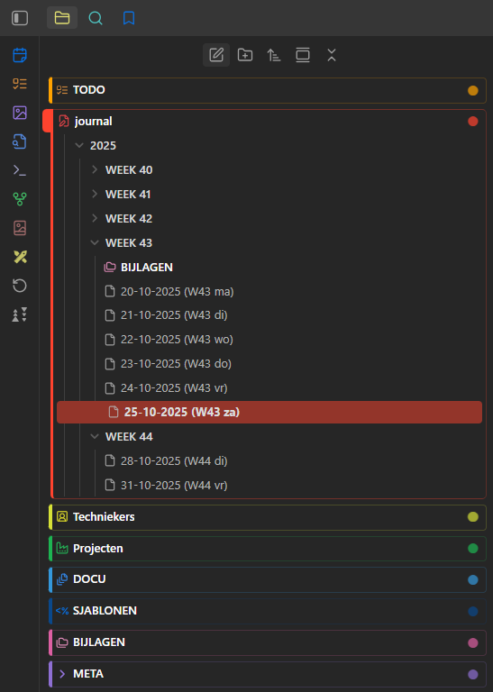
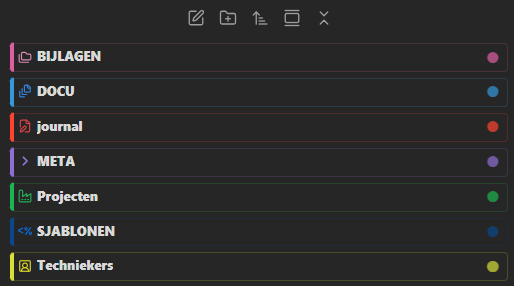
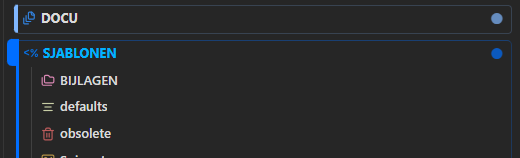
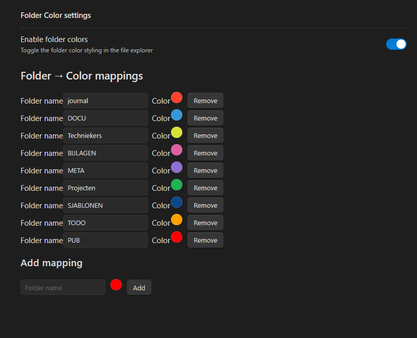

# Colorful Folder Tabs

Enhance your Obsidian file explorer with **custom folder colors, optional text colors, font weights, highlights, and a tab-style layout**. Easily distinguish main folders and subfolders at a glance.  

use it with the "iconic plugin" to add custom icons to folders/files: 
- https://obsidian.md/plugins?id=iconic

use it with "custom file explorer sorting" to customize the order of folders and files: 
- https://obsidian.md/plugins?id=custom-sort

---

## Features

- **Enable/Disable folder colors** with a single toggle.  
- **Background color picker** for each folder.  
- **Optional text color** per folder.  
- **Colored dot indicator** for top-level folders.  
- **Custom font weight** for:  
  - Main folders (top-level)  
  - Subfolders  
- **Highlighted folders in the explorer** — makes folders stand out visually.  
- **Tab-style layout** for top-level folders for easier navigation.  
- Works seamlessly with **custom themes** — will **not override colors set by your theme**.  
- In themes like **Blue Topaz**, the background color can be used to pick the folder style.  
- Dynamic application — changes appear immediately in the file explorer.  
- Defaults are applied if no custom values are set.  


## Screenshots







## Installation

1. Download the latest release `.zip` from the [releases page](https://github.com/bjornclauw/colorful-folder-tabs/releases).  
2. Extract the contents into your Obsidian vault under `/.obsidian/plugins/colorful-folder-tabs/`.  
3. Open Obsidian, go to **Settings → Community Plugins → Colorful Folder Tabs**, and enable it.  


## Usage

1. Open **Settings → Colorful Folder Tabs**.  
2. Configure your folders:  
   - **Background color**: Pick a color for the folder.  
   - **Set text color**: Toggle and pick a custom text color.  
   - **Show colored dot**: Enable/disable small dot indicator for top-level folders.  
   - **Main folder font weight**: Adjust font weight for top-level folders.  
   - **Subfolder font weight**: Adjust font weight for subfolders.  
3. Toggle **Enable folder colors** to apply or remove styles.  

> Font weight and folder colors are independent — font weights are applied even if folder colors are disabled.  
> Folder colors are applied **without overriding your theme**, but the background color can be used by themes (like Blue Topaz) to determine folder style.  
> The plugin also **adds subtle highlights** in the file explorer and uses a **tab-style layout** for top-level folders.  


## Settings Reference

| Setting | Description | Default |
|---------|-------------|---------|
| Enable folder colors | Toggle folder color styling in the file explorer | `false` |
| Show colored dot | Display a small dot next to top-level folders | `false` |
| Main folder font weight | Font weight for top-level folders | `700` |
| Subfolder font weight | Font weight for subfolders | `500` |
| Folder mappings | Custom folder → color mappings | None |


## Development

Clone the repository:

```bash
git clone https://github.com/yourusername/colorful-folder-tabs.git
cd colorful-folder-tabs
npm install
```

Build the plugin:

```bash
npm run build
```
Open your vault in Obsidian with Developer Mode enabled to test your changes.


## Contributing

Contributions, bug reports, and feature requests are welcome! Please follow standard GitHub workflows: fork → branch → PR.


## License

Copyright (C) 2020-2025 by Dynalist Inc.

Permission to use, copy, modify, and/or distribute this software for any purpose with or without fee is hereby granted.

THE SOFTWARE IS PROVIDED "AS IS" AND THE AUTHOR DISCLAIMS ALL WARRANTIES WITH REGARD TO THIS SOFTWARE INCLUDING ALL IMPLIED WARRANTIES OF MERCHANTABILITY AND FITNESS. IN NO EVENT SHALL THE AUTHOR BE LIABLE FOR ANY SPECIAL, DIRECT, INDIRECT, OR CONSEQUENTIAL DAMAGES OR ANY DAMAGES WHATSOEVER RESULTING FROM LOSS OF USE, DATA OR PROFITS, WHETHER IN AN ACTION OF CONTRACT, NEGLIGENCE OR OTHER TORTIOUS ACTION, ARISING OUT OF OR IN CONNECTION WITH THE USE OR PERFORMANCE OF THIS SOFTWARE.


## Support

If you like my work and want to support development, feel free to buy me a coffee ☕:

[](https://www.buymeacoffee.com/bjornclauw)
