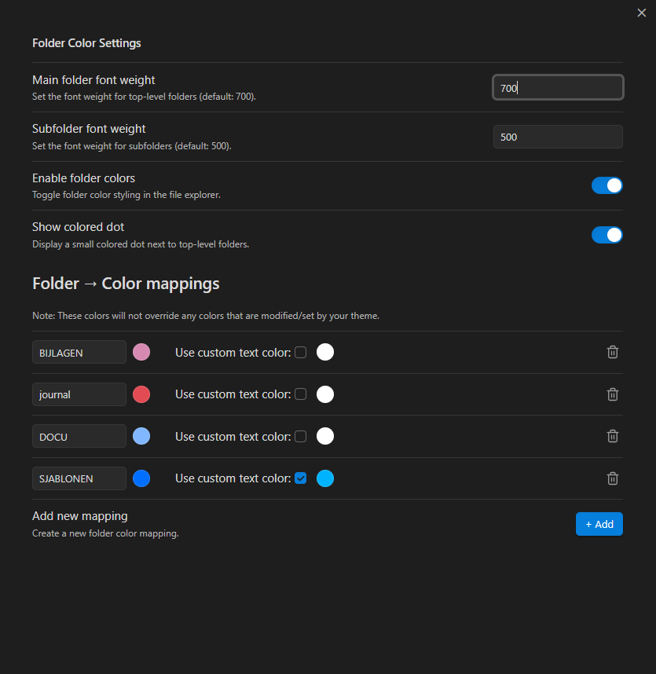

# Obsidian plugin: Colorful folder tabs

## Description
Colorful Folder Tabs – Enhance the Obsidian default theme file explorer by adding colored folder labels, optional colored dots for top-level folders, and bold fonts to clearly distinguish top-level folders from subfolders. Updates dynamically as folders are added or renamed.

use it with the "iconic plugin" to add custom icons to folders: https://obsidian.md/plugins?id=iconic
usi it with "custom file explorer sorting" to customize the order of folders and files: https://obsidian.md/plugins?id=custom-sort

## Screenshots
### Example

### Settings

## Installation Guide

### 1. Download the Plugin

1. Download the plugin repository from GitHub (or the source you obtained it from).  
   You should have a folder containing at least:
   - `main.js`
   - `manifest.json`
   - `styles.css`

2. Rename the folder if necessary, e.g., `colorful-folder-tabs`.

### 2. Move the Plugin to Your Vault

1. Open your Obsidian vault.
2. Navigate to the hidden `.obsidian/plugins/` folder.
   - If the `plugins` folder does not exist, create it.
3. Move the `colorful-folder-tabs` folder (containing the plugin files) into `.obsidian/plugins/`.

Your folder structure should look like this:

.your-vault/
└─ .obsidian/
└─ plugins/
└─ colorful-folder-tabs/
├─ main.js
├─ manifest.json
└─ styles.css

### 3. Enable the Plugin in Obsidian

1. Open Obsidian and go to **Settings → Community plugins**.
2. If **Safe Mode** is enabled, disable it.
3. Click **Installed plugins**, find **colorful-folder-tabs**, and toggle it **ON**.

### 4. Configure Folder Colors

1. Go to **Settings → colorful-folder-tabs**.
2. Options include:
   - **Enable folder colors:** Toggle all plugin styling.
   - **Show colored dot:** Add a small colored dot to top-level folders.
   - **Folder → Color mappings:** Define background and text colors per folder name.
3. Changes are applied **immediately** and dynamically update as folders are added or renamed.

### 5. Enjoy Your Custom File Explorer

Your Obsidian file explorer will now display custom colors, dots, and bold fonts, improving visual navigation and organization.

## How to build

- Clone this repo.
- Make sure your NodeJS is at least v16 (`node --version`).
- `npm i` or `yarn` to install dependencies.
- `npm run dev` to start compilation in watch mode.
